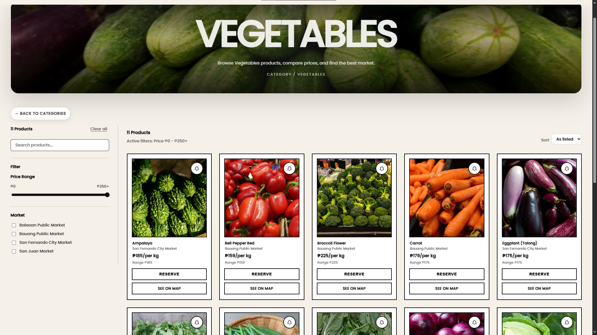
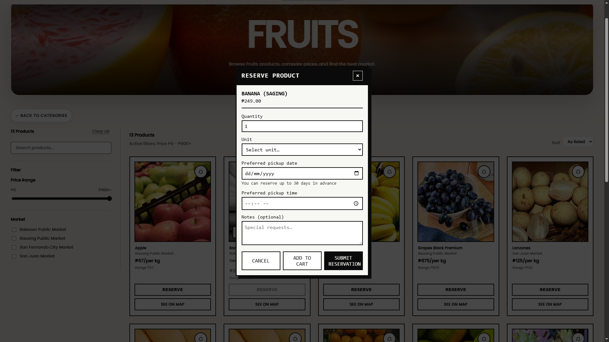
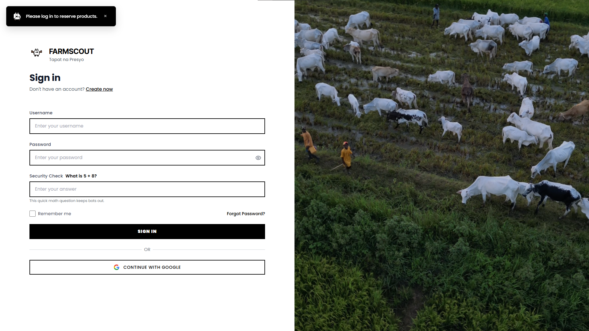

# FarmScout Online

Web app for **Baloan Public Market**: product discovery, price comparison, multi-product reservations, farmer and admin dashboards, and reservation-linked chat.

**Stack:** PHP 7.4+ (PDO), MySQL, Vite + React SPA (`spa-src/` → `app/`), Apache/XAMPP-friendly layout.

> Portfolio / academic project — suitable for OJT, capstone, or resume demos. Configure your own `.env` and database; do not commit secrets.

## Screenshots

### Products page


### Reserve product (modal)


### Login


---

## Highlights (for recruiters)

- Consumer SPA for browsing markets, products, and price trends
- Reservation flow with optional **multi-product cart** and public reference IDs (`RSV-YYYY-NNNN`, `CHAT-YYYY-NNNN`)
- Farmer and **DTI/admin** tooling (dashboards, reference prices, logs)
- Real-time-style **chat** tied to reservations
- Google Maps integration (optional API key via `.env`)
- Structured PHP APIs under `api/` + shared `includes/enhanced_functions.php`

---

## Requirements

- PHP **7.4+** with extensions: **pdo_mysql**, **json**, **mbstring**, **openssl** (as needed by your host)
- MySQL **5.7+** / MariaDB **10.3+**
- **Node.js 18+** and npm (only to build the SPA from `spa-src/`)

---

## Local setup (XAMPP-style)

1. **Clone** this repo into your web root, e.g. `htdocs/farmscout_online`.

2. **Environment**
   - Copy `config/env.sample` to **`.env`** in the project root (same folder as `index.php`).
   - Edit `.env`: set `DB_*`, `APP_URL` (match your folder URL, e.g. `http://localhost/farmscout_online`), and optional email / Google Maps / OAuth keys.

3. **Database** — see [`database/README.md`](database/README.md)
   - Create database `farmscout_online`.
   - Run `database/schema.sql`, then `install_missing_dashboard_tables.sql`, then `reservation_multi_product_and_public_refs.sql`.
   - Do **not** commit `database/farmscout_online.sql` (local exports may contain SMTP passwords and real user data).

4. **Build the SPA** (writes into `app/` — `index.html`, hashed JS/CSS under `app/assets/`)

   ```bash
   cd spa-src
   npm install
   npm run build
   ```

   `postbuild` runs a small prune so old hashed bundles under `app/assets/` are not left behind.

5. **Open the app**  
   Point the browser at your app URL, e.g. `http://localhost/farmscout_online/app/` for the SPA home, or `index.php` / `login.php` for classic PHP entry points depending on how you host it.

---

## Project layout (short)

| Path | Role |
|------|------|
| `api/` | JSON APIs (reservations, chat, products, auth helpers, …) |
| `app/` | **Production SPA output** (do not edit by hand; rebuild from `spa-src`) |
| `spa-src/` | Vite + source for the SPA (`npm run build`) |
| `app/js/`, `app/css/` | Shared scripts/styles (e.g. reservation modal) loaded by pages |
| `includes/` | PHP includes (`enhanced_functions.php`, security, headers, chat shell) |
| `config/` | `database.php`, `env.sample`, email/maps config |
| `database/` | SQL migrations and exports |

---

## Deploy notes

- Deploy **PHP**, `api/`, `includes/`, `config/` (without committing real secrets), **`app/`** after `npm run build`, plus `app/js` and `app/css` if you use them on the server.
- Run the same **MySQL migrations** on the server DB as on local (including `reservation_multi_product_and_public_refs.sql` if you use multi-item reservations).
- Ensure `storage/` (and any cache dirs your config uses) are **writable** by the web server if applicable.

---

## Publish on GitHub (resume)

1. **Before the first push** — confirm `.env` is not tracked and `database/farmscout_online.sql` is ignored (see `.gitignore`).
2. From the project folder:

   ```bash
   git init
   git add .
   git status
   ```

   Review `git status`: no `.env`, no `farmscout_online.sql`, no `node_modules`.

3. Commit and push:

   ```bash
   git commit -m "Initial commit: FarmScout Online capstone project"
   git branch -M main
   git remote add origin https://github.com/YOUR_USERNAME/farmscout-online.git
   git push -u origin main
   ```

4. On the repo page, add a short **About** description and topics: `php`, `mysql`, `vite`, `react`, `capstone`.

5. Optional: add 2–3 screenshots under `docs/screenshots/` for the README.

## License / academic use

Use and adapt for **OJT / capstone / portfolio** as allowed by your school or employer; add your own license file if you publish publicly.
